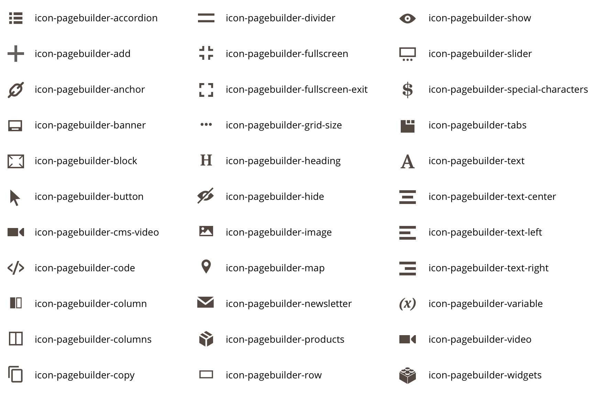
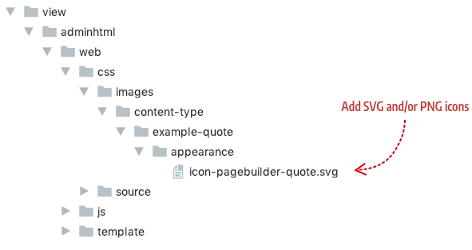

# Iconography

## Overview

PageBuilder Admin icons follow the same design principles as the core [Magento Admin icons].
They are simple, flat, and monochromatic to prevent the loss of detail at smaller sizes and makes the shapes easier to comprehend.

## Page Builder icons

The following image shows all available PageBuilder Admin icons with class names to reference them by:

{:width="870px" height="auto"}

You can use these icons when extending or customizing the PageBuilder module or create your own icons using SVG files or icon fonts as described next.

## Creating SVG or PNG icons

To add your own icons, we recommend creating SVG icons because they are smaller and render more clearly on high-resolution screens, including mobile devices. 

The size of the icons you create depends on where within Page Builder you want to use them. You can add icons to Page Builder in three areas:

- Panel
- Form
- Stage

### Panel icons

To create a panel icon that integrates seamlessly with the existing panel icons, use the following specifications:


The *artboard* represents the actual width and height of your icon when it is exported from your graphics application (16 x 16px). The *artwork* represents the content of your icon. Following these dimensions ensures your icons will match the size and positioning of the existing Page Builder icons within the panel.

### Form and stage icons

The native Page Builder icons found in forms and on the Admin stage are a variety of sizes, from 20 x 20px up to almost 200px in width, as shown here:


The best way to decide how big to create your form or stage icons is to inspect the sizes of the Page Builder's existing icons from the browser dev tools. The idea is to emulate the icon sizes as closely as possible to ensure that your icons integrate well and look professional alongside Page Builder's existing icons. 

## Adding your icons

Add all your SVG and/or PNG icons to the `adminhtml/web/css/images` directory for your content type. For example, if your content type is called `example-quote`, you would put your icons in `adminhtml/web/css/images/content-type/example-quote/appearance/` as follows: 



## Create CSS classes for your icons

For each SVG or PNG icon you create, add a CSS class to your LESS file in `adminhtml` as shown here:


Creating a  CSS class for each icon provides an easy way to reference and display your icons in a variety of places throughout Page Builder. The following CSS rule set shows one way to link to your icons through CSS:  

```css
.icon-pagebuilder-quote {
    background-image: url('@{baseDir}Example_PageBuilderQuote/css/images/content-type/example-quote/appearance/icon-pagebuilder-quote.svg');
    width: 16px;
    height: 16px;
}
```

| Attribute              | Description                                                  |
| ---------------------- | ------------------------------------------------------------ |
| `class name`           | To match the class names of Page Builder's native icons, we recommend prefixing your icon names with `icon-pagebuilder` as we have done with the Quote panel icon. |
| `background-image url` | The `url` used for the `background-image` is the most critical part of the CSS. Always use the `@{baseDir}` variable followed by your full module name, followed by the path to your image, starting with `css`. When deployed, Page Builder creates a link in the static output where the browser can resolve it as described below. |
| `width`                | Sets the width of the icon image.                            |
| `height`               | Sets the height of the icon image.                           |

When deployed, your icon images are linked from `pub/static` as shown here: 


[Magento Admin icons]: https://devdocs.magento.com/guides/v2.2/pattern-library/graphics/iconography/iconography.html
[create your own icons]: https://devdocs.magento.com/guides/v2.2/pattern-library/graphics/iconography/iconography.html#creating-icons
[cms-icons repository]: https://github.com/magento-ux/cms-icons

